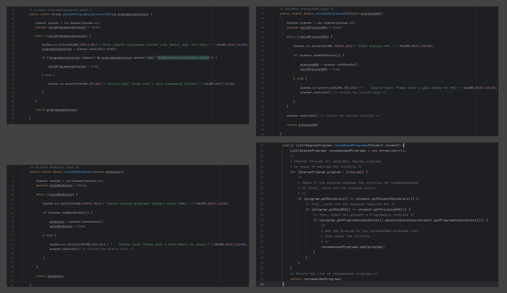
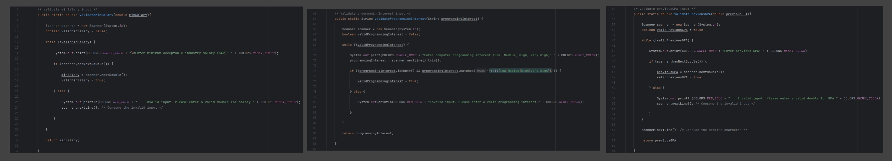
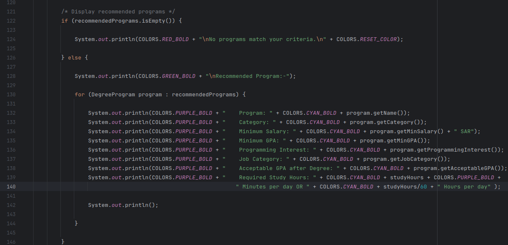
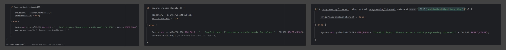
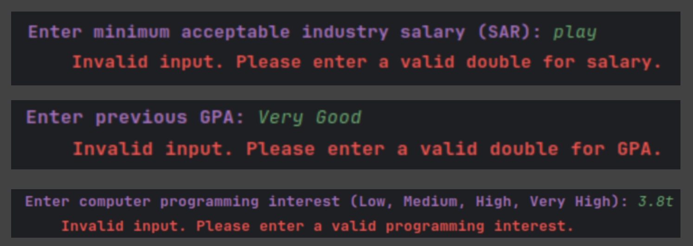

# Report on Degree Program Recommendation System

## Introduction

This report presents an overview of the "Degree Program Recommendation System" implemented in Java. The system is designed to recommend suitable degree programs to students based on their specified criteria, including minimum acceptable industry salary, previous GPA, and computer programming interest. The system provides valuable guidance to students seeking admission to the College of Computer Science and Engineering at the University of Jeddah, helping them make informed decisions about their educational paths.

## Code Overview

The code for the Degree Program Recommendation System is organized into four main Java classes:

1. **Main.java**: This class serves as the entry point of the application and handles user input validation, data collection, and presentation of recommended degree programs.

2. **ProgramRecommendation.java**: This class is responsible for recommending degree programs based on the criteria provided by the student. It contains a list of predefined degree programs, and it applies filtering logic to identify programs that match the student's criteria.

3. **DegreeProgram.java**: The DegreeProgram class represents individual degree programs and their criteria. It includes attributes such as program name, category, minimum salary, minimum GPA, programming interest, job category, and acceptable GPA after degree completion.

4. **Student.java**: The Student class encapsulates the data related to the student, including their minimum acceptable industry salary, previous GPA, and computer programming interest.

## User Input Validation

The code includes input validation mechanisms to ensure that user-provided data is accurate and within acceptable bounds. Three methods (`validateMinSalary`, `validatePreviousGPA`, and `validateProgrammingInterest`) validate the user's input for minimum salary, previous GPA, and programming interest, respectively. These methods prompt the user for input until valid data is provided, helping to maintain data integrity.

## Program Recommendation Logic

The heart of the system lies in the `recommendPrograms` method within the `ProgramRecommendation` class. This method uses a list of predefined degree programs and filters them based on the student's criteria. The following criteria are considered for program recommendation:

- Minimum acceptable industry salary
- Minimum required GPA
- Programming interest (case-insensitive)

Only programs that meet all of these criteria are recommended to the student.

## User Interaction

The code provides a user-friendly interface for interacting with the system. It displays recommended degree programs along with relevant details, including program name, category, minimum salary, minimum GPA, programming interest, job category, acceptable GPA after degree completion, and required daily study hours.

## Conclusion

the Degree Program Recommendation System is a valuable tool for students seeking guidance on selecting an appropriate degree program within the College of Computer Science and Engineering at the University of Jeddah. It employs input validation, program recommendation logic, and user-friendly interaction to assist students in making informed decisions about their educational journey. The codebase is well-structured and follows best practices for readability and maintainability.

___

## Design Principles

1. **Simplicity of Design:** The code follows a simple and straightforward design, making it easy to read, understand, and maintain. Classes such as(each class has its own responsibilities):

   - `Student`: represents student information `studentMinSalary` `previousGPA` `programmingInterest`.
   - `DegreeProgram`: represents degree program details `name` `category` `minSalary` `minGPA` `programmingInterest` `jobCategory` `acceptableGPA`.
   - `ProgramRecommendation` to recommend the program to the student.

2. **Abstraction:** Simplifying complex systems by breaking them into smaller, more manageable parts (it is applied via functions):

   - `recommendPrograms` in the *`ProgramRecommendation`* class to recommend the program to the student.
   - `validateMinSalary`, `validateMinSalary`, `validateMinSalary` in the *`Main`* class to validate Student input
   - 

3. **Component's Integration:** The code integrates different components, including the `Student` class, the `DegreeProgram` class, and the `ProgramRecommendation` class, to recommend degree programs based on a student's criteria.

4. **Complete Mediation:** The `ProgramRecommendation` class acts as a mediator between the `Student` class and the `DegreeProgram` class, facilitating the recommendation process by mediating interactions and decisions.

5. **Isolation:** The use of private variables and encapsulation in the `Student` and `DegreeProgram` classes isolates the internal state of these classes from external access, promoting data integrity.

6. **Fail-Safe Default and Fail-Secure:** Error handling and input validation are implemented in the `Main` class to handle invalid student input gracefully, ensuring that the program doesn't crash due to unexpected input.

   - 

7. **Separation of duties:** Each class in the code has a well-defined responsibility. For example: 

   - `Student` class represents student information.
   - `DegreeProgram` class represents degree program details.
   - `ProgramRecommendation` class handles the recommendation logic. 
   - This separation of duties enhances code maintainability.

8. **Usability:** The code interacts with the user through a console-based interface, providing clear prompts and error messages for input validation, enhancing usability.

    - 

___

## Requirements

1. **Confidentiality**:
   - To protect confidential data, we have to implement input validation to ensure that sensitive user input, such as salary and GPA, is securely handled.
     - 
   - Avoid displaying sensitive information in error messages or logs.
     - 
   - implement encapsulation: The `DegreeProgram` and `Student` classes have **private** fields and **getter/setter** methods to control access to their data, which is a basic form of confidentiality control. 

2. **Integrity**:
   - To ensure data integrity, we have to implement:
     - implement data validation and error handling to prevent unauthorized changes to the program's state.
     - 

3. **Availability**:
   - Availability refers to the system's ability to remain operational and accessible. In this context, we have to ensure that the program remains available to users and can handle unexpected errors without crashing.
      - Implement proper error handling to prevent unhandled exceptions Like Using defensive coding practices to handle unexpected inputs to prevent program failures.
        - 

___

## Requirements 2

1. **Gathering Information about the Application (Including Security-Related Information)**:
   - The code defines two main classes: `Student` and `DegreeProgram`, which capture information about students, degree programs, and their criteria.
   - The `Student` class stores data related to students, including their minimum acceptable industry salary, previous GPA, and programming interest.
   - The `DegreeProgram` class stores data related to degree programs, including their name, category, minimum salary, minimum GPA, programming interest, job category, and acceptable GPA.
   - In the `ProgramRecommendation` class, a list of `DegreeProgram` objects is initialized with predefined data, which includes information about degree programs, such as their salary requirements, GPA requirements, and programming interest.

2. **Analyzing Requirements**:
   - The code includes basic validation of Student input for minimum salary, previous GPA, and programming interest. This validation helps in ensuring data integrity to some extent.
     - **Integrity**: The code ensures the integrity of data within the `Student` and `DegreeProgram` objects by providing getter and setter methods, it checks out whether the user inputs are valid or not (using these functions in the Main Class `validateMinSalary`, `validateMinSalary`, `validateMinSalary`)
     - **Confidentiality**: The `DegreeProgram` and `Student` classes have **private** fields and **getter/setter** methods to control access to their data, which is a basic form of confidentiality control.

___

## Requirements 3

1. **User Input Requirements:**
    - The program must prompt the user to enter the minimum acceptable industry salary (SAR).
    - The program must prompt the user to enter their previous GPA.
    - The program must prompt the user to select their computer programming interest level (Low, Medium, High, Very High).
    - The program should handle invalid input gracefully and request valid input from the user.

2. **Student Criteria Requirements:**
    - The program should store and utilize the entered student criteria, including minimum salary, previous GPA, and programming interest.

3. **Degree Program Data:**
    - The program should have a predefined list of degree programs, each with specific attributes, including name, category, minimum salary, minimum GPA, programming interest, job category, and acceptable GPA after the degree.

4. **Recommendation Algorithm:**
    - The program must implement a recommendation algorithm that matches student criteria with degree program criteria.
    - Recommended degree programs should meet or exceed the student's minimum salary and GPA requirements and match their programming interest.
    - The program should calculate the required study hours based on the student's GPA and display this information.

5. **Output Requirements:**
    - The program should display a list of recommended degree programs that meet the student's criteria.
    - If no programs match the criteria, the program should inform the user.

6. **Code Organization:**
    - The code must be organized into classes and methods with clear responsibilities, promoting maintainability.

7. **Error Handling:**
    - The program should handle errors and invalid input to ensure that it does not crash during execution.

8. **User Interface (UI):**
    - The program should provide a text-based user interface for input and output, making it accessible via the command line.

9. **Extensibility:**
    - The code should be designed to allow for the addition of new degree programs and criteria without modifying existing classes (open design).

10. **Security:**
    - While not explicitly addressed in the code, ensuring that user data is handled securely could be considered a requirement in a real-world application.
